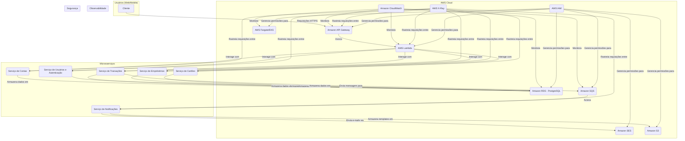

## Projeto de Sistema Bancário com AWS

Este documento detalha os requisitos funcionais e não funcionais para a criação de um sistema bancário pessoal completo, projetado com uma arquitetura modular e futuramente em microsserviços e integrado com os serviços da Amazon Web Services (AWS). O objetivo é construir um projeto robusto, escalável e seguro, ideal para um portfólio de destaque.

### Visão Geral da Arquitetura

A arquitetura será baseada em microsserviços, onde cada serviço é responsável por uma funcionalidade de negócio específica. Essa abordagem promove a agilidade no desenvolvimento, a escalabilidade independente dos serviços e a resiliência do sistema como um todo. A comunicação entre os microsserviços será realizada de forma síncrona (via APIs REST) e assíncrona (através de filas e eventos), garantindo o desacoplamento e a eficiência.

A infraestrutura será gerenciada como código utilizando **Terraform**, permitindo a automação do provisionamento e da configuração dos recursos na AWS.

### Diagrama da Arquitetura de Alto Nível

### Microsserviços e Funcionalidades

A seguir, a decomposição dos microsserviços e suas respectivas funcionalidades:

#### 1\. Serviço de Usuários e Autenticação

* **Responsabilidade:** Gerenciar o ciclo de vida dos usuários e garantir a segurança do acesso.
* **Funcionalidades:**
    * Cadastro de novos clientes (KYC - Know Your Customer simplificado).
    * Login com e-mail e senha.
    * Autenticação de dois fatores (2FA) via e-mail ou aplicativo de autenticação.
    * Recuperação de senha.
    * Gerenciamento de perfil do usuário (dados pessoais, endereço).
    * Upload de documentos de identificação.
* **Integração AWS:**
    * **Amazon Cognito:** Para gerenciamento de identidades e autenticação.
    * **Amazon S3:** Para armazenamento seguro dos documentos de identificação.

#### 2\. Serviço de Contas

* **Responsabilidade:** Gerenciar as contas correntes e poupança dos clientes.
* **Funcionalidades:**
    * Criação de conta corrente e conta poupança.
    * Consulta de saldo e extrato detalhado.
    * Geração de segunda via de extratos em PDF.
    * Informações da conta para transferências (agência, número da conta).
* **Integração AWS:**
    * **Amazon RDS (PostgreSQL):** Para persistência dos dados das contas de forma relacional e transacional.

#### 3\. Serviço de Transações

* **Responsabilidade:** Orquestrar todas as movimentações financeiras.
* **Funcionalidades:**
    * Transferências entre contas do mesmo banco.
    * Transferências para outros bancos (simulação de TED/DOC).
    * Pagamento de contas de consumo (boletos).
    * Depósitos (simulados).
    * Agendamento de transações.
    * Busca e filtro de transações por data, tipo e valor.
* **Integração AWS:**
    * **Amazon RDS (PostgreSQL):** Para registro das transações.
    * **Amazon SQS (Simple Queue Service):** Para processamento assíncrono de transações, como o agendamento e a liquidação de pagamentos, garantindo que falhas em serviços externos não impactem a experiência do usuário.

#### 4\. Serviço de Notificações

* **Responsabilidade:** Enviar comunicações aos clientes.
* **Funcionalidades:**
    * Envio de e-mail de boas-vindas após o cadastro.
    * Notificações de transações realizadas (transferências, pagamentos).
    * Alertas de segurança (login em novo dispositivo).
    * Envio de extratos mensais.
* **Integração AWS:**
    * **Amazon SES (Simple Email Service):** Para o envio de e-mails de forma escalável e com alta taxa de entrega.
    * **Amazon SQS:** Para receber eventos de outros microsserviços que disparem notificações.
    * **AWS Lambda:** Para processar as mensagens da fila do SQS e acionar o envio de e-mails pelo SES.

#### 5\. Serviço de Empréstimos (Funcionalidade Avançada)

* **Responsabilidade:** Gerenciar o ciclo de vida de empréstimos pessoais.
* **Funcionalidades:**
    * Simulação de propostas de empréstimo.
    * Solicitação de empréstimo.
    * Análise de crédito (simplificada).
    * Visualização de contratos e parcelas.
    * Acompanhamento do pagamento das parcelas.
* **Integração AWS:**
    * **Amazon RDS (PostgreSQL):** Para armazenar os dados dos empréstimos.
    * **AWS Step Functions:** Para orquestrar o fluxo de aprovação de um empréstimo, que pode envolver múltiplos passos e verificações.

#### 6\. Serviço de Cartões (Funcionalidade Avançada)

* **Responsabilidade:** Gerenciar cartões de crédito e débito.
* **Funcionalidades:**
    * Solicitação de cartão de crédito.
    * Visualização da fatura do cartão de crédito.
    * Bloqueio e desbloqueio do cartão.
    * Ativação para uso internacional.
    * Criação de cartão virtual para compras online.
* **Integração AWS:**
    * **Amazon RDS (PostgreSQL):** Para persistência dos dados dos cartões.
    * **AWS Lambda:** Para processar solicitações de bloqueio/desbloqueio em tempo real.

### Integração com Serviços AWS

A seguir, o detalhamento da utilização dos serviços da AWS no projeto:

* **Amazon API Gateway:** Servirá como ponto de entrada único para todas as requisições dos clientes. Será responsável por rotear as requisições para os microsserviços correspondentes (via integração com Lambda ou diretamente com os serviços em Fargate/EKS). Implementará funcionalidades como throttling (limitação de requisições) e validação de requisições.

* **AWS Lambda:** Será utilizado para a implementação de funções de backend de curta duração e orientadas a eventos. Ideal para o "glue code" entre serviços, como o processamento de mensagens do SQS pelo serviço de notificações.

* **Amazon RDS (PostgreSQL):** Será o banco de dados relacional para os microsserviços que exigem consistência transacional forte, como Contas, Transações e Empréstimos.

* **Amazon SQS (Simple Queue Service):** Essencial para a comunicação assíncrona. Desacoplará os microsserviços, permitindo que o sistema continue funcionando mesmo que um serviço esteja temporariamente indisponível.

* **Amazon SES (Simple Email Service):** Solução para o envio de e-mails transacionais e de marketing, com alta confiabilidade.

* **Terraform:** Toda a infraestrutura na AWS será definida como código utilizando Terraform. Isso garantirá a reprodutibilidade do ambiente e facilitará a automação do provisionamento.

* **Observabilidade:**

    * **Amazon CloudWatch:** Para coleta de logs, métricas e criação de alarmes para todos os serviços da AWS utilizados.
    * **AWS X-Ray:** Para rastreamento distribuído das requisições, permitindo visualizar o fluxo de uma chamada desde o API Gateway até os bancos de dados, identificando gargalos e erros em toda a arquitetura de microsserviços.

* **Conteinerização e Orquestração:**

    * **Docker:** Os microsserviços serão empacotados em contêineres Docker.
    * **AWS Fargate ou Amazon EKS (Elastic Kubernetes Service):** Para a execução e orquestração dos contêineres. O Fargate oferece uma abordagem serverless mais simples, enquanto o EKS proporciona maior controle e flexibilidade com o Kubernetes.

### Requisitos Não Funcionais

* **Segurança:**

    * **Autenticação e Autorização:** Utilização de JWT (JSON Web Tokens) para proteger as APIs. O Amazon Cognito pode gerenciar a emissão e validação desses tokens.
    * **Criptografia:** Criptografia de dados em trânsito (TLS) e em repouso (KMS para RDS e S3).
    * **IAM Roles:** Concessão de permissões mínimas necessárias para cada serviço da AWS (Princípio do Menor Privilégio).

* **Escalabilidade:** A arquitetura de microsserviços permite que cada serviço seja escalado horizontalmente de forma independente, utilizando os recursos de auto-scaling da AWS (para Fargate, EKS e Lambda).

* **Disponibilidade:** A utilização de múltiplas Zonas de Disponibilidade (Multi-AZ) para o Amazon RDS e para os serviços de contêineres garantirá a alta disponibilidade do sistema.

* **Performance:**

    * Latência de API: As requisições devem ter um tempo de resposta médio inferior a 500ms.
    * Processamento de transações: As transações críticas devem ser processadas em tempo real (síncronas), enquanto as não críticas podem ser processadas de forma assíncrona para não impactar a experiência do usuário.

* **Manutenibilidade:** O código-fonte deve ser bem documentado, com testes unitários e de integração. A separação em microsserviços facilitará a manutenção e a evolução de cada parte do sistema de forma independente.

### Roadmap Sugerido para o Projeto

1.  **MVP (Minimum Viable Product):**

    * Serviço de Usuários e Autenticação (cadastro e login).
    * Serviço de Contas (criação de conta e consulta de saldo/extrato).
    * Serviço de Transações (transferências entre contas internas).
    * Serviço de Notificações (e-mail de boas-vindas e notificação de transferência).
    * Infraestrutura básica com Terraform (API Gateway, Lambda, RDS, SQS, SES).

2.  **Fase 2:**

    * Implementação do pagamento de boletos.
    * Transferências para outros bancos (simulado).
    * Melhorias na segurança com 2FA.
    * Configuração do CloudWatch e X-Ray para observabilidade.

3.  **Fase 3 (Funcionalidades Avançadas):**

    * Desenvolvimento do Serviço de Empréstimos.
    * Desenvolvimento do Serviço de Cartões.
    * Implementação de CI/CD com AWS CodePipeline ou GitHub Actions para automatizar o deploy.

Ao seguir esta estrutura, você terá um projeto de sistema bancário extremamente completo e alinhado com as práticas mais modernas de desenvolvimento de software e cloud computing, tornando seu portfólio muito mais atraente para o mercado de trabalho.
